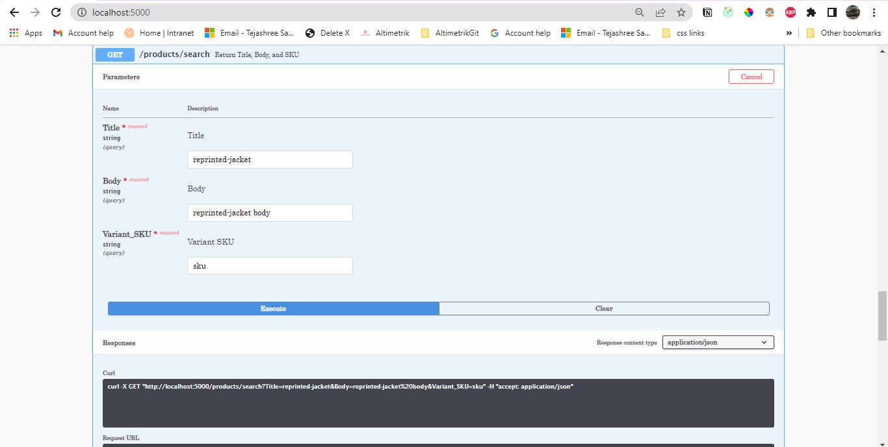

### Flask Application for CRUD operation on products 

### Below are the output of the Application:

#### - List items (GET)

#### - List items by Title, Body, SKU (GET) - Body should have wildcard search

#### - Create item (POST)

#### - Delete item (DELETE)

#### - Export as CSV(GET)

